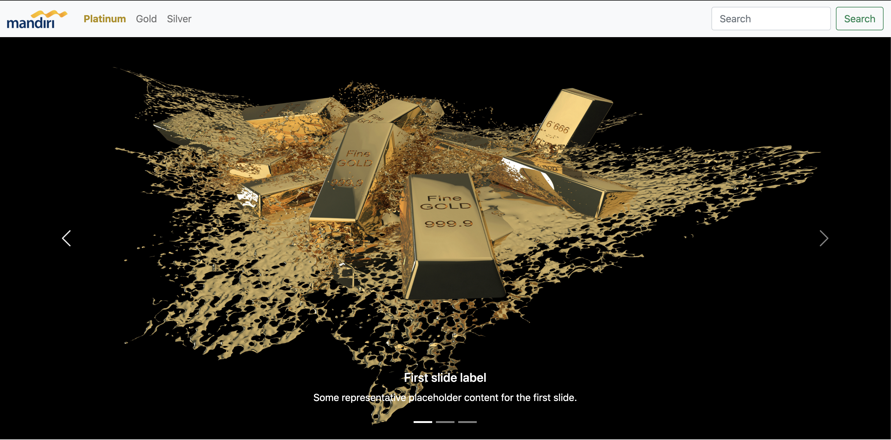
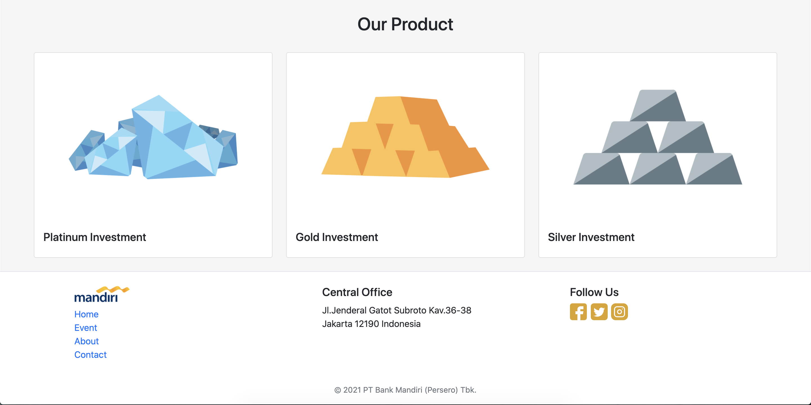

# Gold Market
## How To Start
- Clone the project with syntax 
`git clone https://github.com/mkamilmistar/gold-market.git`
- Run 
`npm install`
- The last step is run 
`ng serve --open`

## Tech in Use
* SweetAlert
* CanvasJS
* Angular Routing
* HTML
* CSS
* Typescript

## URL
* Home
`/home`
* Register
`/register`
* Login
`/login`

## ScreenShot

    
    
    

